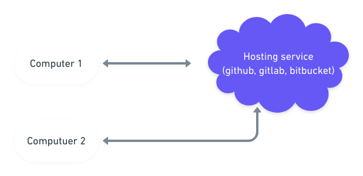
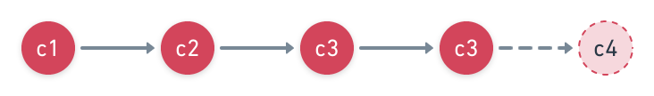
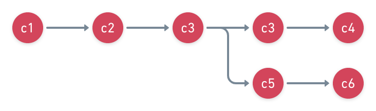

# discover-git

A tutorial to discover git

- [Introduction](Introduction)
- [Architecture](Architecture)
- [Installation](Installation)
  - [Windows & macOS](Windows & MacOS)
  - [Linux](Linux)
- [Getting started](Getting started)
- [Commit](Commit)
- [Remote](Remote)
- [Branch](Branch)

## Introduction

[Git](https://git-scm.com/) is a versioning tool created by [Linus Torvals](https://fr.wikipedia.org/wiki/Linus_Torvalds) to manage development projects. With git, you can:

- save remotely your work: you won't lose everything if your computer crashes
- work on a project with others: you won't lose time to share your work depending on how many teammates you have
- rollback whatever change you want: you won't fear to break your project
- identify who wrote each line: you will be able to ask for help to the author

Git is not the only tool to provide these features. Some other tools like [SVN](https://subversion.apache.org/) but git is the most popular and its strong architecture make it very relevant for collaboration.

So using git may need training but it worths it.

## Architecture

Git is a technology designed to be useful in peer-to-peer but main projects use it with
an architecture client/server.

<p align="center">

</p>

With git, a project is called a **repository**.

## Installation

### Windows & macOS

Download and install [git bash](https://git-scm.com/downloads).

[Graphical client also exist.](https://git-scm.com/downloads/guis)

The most popular graphical clients are:

- [Tortoise git](https://tortoisegit.org/)
- [Github desktop](https://desktop.github.com/)
- [Kraken](https://www.gitkraken.com/)

### Linux

```bash
# on Ubuntu
apt-get install git
```

## Getting started

Download your repository using following command:

```bash
git clone https://github.com/friedrith/hello-world-git.git
```

> To follow this tutorial you need to be writing rights on the repository.

## Commit

In git, the developer can gather a certain amount of code changes into a unitary block called **commit**. And so the history of the repository is a chain of **commits**.

<p align="center">

</p>

### List commits

You can see the existent commits in a repository using following command:

```bash
git log
```

This command shows you the commits by reverse chronological order: from the latest one to the first one.

```
commit c99fb1f8a03f8f53823da464b18aead3ccf9008e
Author: Thibault Friedrich <thibault.friedrich@gmail.com>
Date:   Sun Nov 3 09:40:37 2019 -0500

    say hello in german

commit 7e7ed6683d81c4c76d28fab2724b227dead6fd1d
Author: Thibault Friedrich <thibault.friedrich@gmail.com>
Date:   Sun Nov 3 09:40:15 2019 -0500

    say hello in french
```

You can see that each commit is identified by a base64 number, an author, a date and a message.

### Add your own commit

<p align="center">

</p>

ℹ️ Write what you want in file README.md in the repository then create your first commit:

```bash
git commit -am "<your own message>"
```

> Using `git log`, you can see your own commit in the history

### Add a commit with your own file

Your first commit worked because the file was already tracked by git. If you add a new file, it won't be automatically committed by git.

Create your own file.

ℹ️ You can know the untracked files using command:

```bash
git status
```

> This command doesn't change the state of the repository so you can abuse of it without limitations.

ℹ️ Add your file to the git tracking:

```bash
git add <file path>
```

Then you will be able to commit it using `git commit`.

> Be careful to the files you track in your repository. Binary files (except small images), temporary files or build files should not be tracked since they can cause overweight or conflicts. You are incitated to create .gitignore file

## Remote

Once you have saved your changes, you may want to sent it remotely to save permanently and share it.

### Push

In git, the way to send your code is called **push**.

ℹ️ To push your code:

```bash
git push

```

⚠️ When you work locally everything is easily canceable. It is far harder once you have pushed. So use `git push` with caution.

### Pull

You will also need to get the code wrote by the other teammates

ℹ️ To pull your code:

```bash
git pull --rebase # option rebase is not mandatory but strongly recommended

```

> In theory, you could use only above commands to work as a team but other teammates wouldn't be able to see your code before they have it on their computer so it might be dangerous if it breaks their own code.

## Branch

With previous commands, you have been able to save your changes (commit), send it online (push) and get other's work (pull). Now we will see how to navigate between your history, your work and work of other teammates using the recommanded methodologies.

### Separate a side feature

Sometimes, you want to try something without messing your main code. To do that, git integrates a concept called **branch**. So that you can have several branches with a specific state of your code in each branch.

<p align="center">

</p>

ℹ️ Create your own branch

```bash
git branch <branch name> # branch name without spaces, we reommaend your to use only [a-zA-Z0-9_/] characters.
```

ℹ️ See all the available branch

```bash
git branch
```

ℹ️ Switch to your new branch

```bash
git checkout <branch name>
```

Once you have applied changes to your code and committed it in the branch, you can push your branch:

```bash
git push origin <branch name>
```

> Sometimes it is useful to have local branches to test features. If so, you don't need to push the branch. You can juste merge into your main branch following commands below.

### Merge branches

#### Rebase

The **rebase** strategy is the more common way to merge branch since it is the way you should
use on your computer.

Applied changes to your code on the branch <branch name> and commit it then:

```bash
git checkout master # yes master is branch
```

Applied changes

ℹ️ Rebase your code:

```bash
git rebase <branch name>
```

## Useful links

- [Official documentation](https://git-scm.com/docs/git)
- https://rogerdudler.github.io/git-guide/
